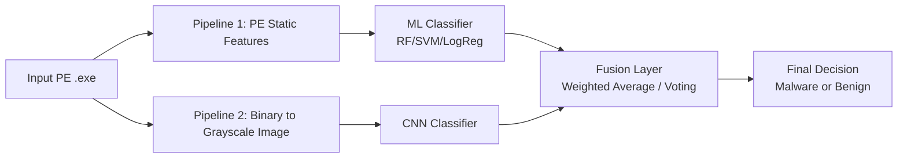

# Hybrid Malware Detection System (PE + CNN)

This project implements a **hybrid static malware detector** for Windows PE executables using:
1. **PE structural feature ML model**
2. **Binary visualization CNN model**
3. **Fusion layer** to combine both probabilities

> ⚠️ Safety first: Never execute malware. This project performs static analysis only.

## 1) Safety Workflow (Mandatory)

- Use an isolated VM (VirtualBox/VMware) with snapshots.
- Use host-only/disconnected network; avoid internet in malware VM.
- Disable clipboard and shared folders between host and guest.
- Keep malware in password-protected archives (`infected`) until needed.
- Validate files with SHA256 before ingestion.
- Keep dataset in dedicated folder; do not upload samples to cloud.

### SHA256 verification example

```bash
sha256sum dataset/malware/sample.exe
```

## 2) Dataset Layout

```text
malware_detection_project/
  dataset/
    malware/
    benign/
```

Suggested sources:
- EMBER
- Microsoft Malware Classification (Kaggle)
- Malimg
- UCI Malware Dataset
- MalwareBazaar
- VirusShare

## 3) Architecture Diagram



## 4) Pipeline 1: PE Feature-Based ML

`feature_extraction.py` extracts:
- section counts/statistics
- optional header fields (`SizeOfCode`, `AddressOfEntryPoint`, `ImageBase`, etc.)
- import table stats (`num_imported_dlls`, `num_imported_apis`)
- DLL indicator features (`kernel32.dll`, `ws2_32.dll`, ...)
- entropy metrics per section

`ml_model.py` trains RF/SVM/LogReg and reports:
- Accuracy, Precision, Recall, F1, ROC-AUC
- Confusion matrix (`tn, fp, fn, tp`)
- RF feature importance (top 20)

## 5) Pipeline 2: Binary Visualization + CNN

`binary_to_image.py`:
1. Reads executable bytes.
2. Converts bytes (0–255) to vector.
3. Reshapes to 2D grayscale matrix.
4. Resizes to fixed dimensions (default 256×256).
5. Saves PNG image preserving class folder.

`cnn_model.py` trains a compact CNN:
- Conv2D + ReLU + MaxPool (x3)
- Dense + Dropout
- Sigmoid output (malware probability)

Why it works: byte layout (code/data/resource packing patterns, section structure, and obfuscation artifacts) often creates family-specific texture patterns in grayscale space.

## 6) Fusion Strategy

`ensemble.py` supports:
- weighted probability averaging:
  `final = w_ml * p_ml + w_cnn * p_cnn`
- majority vote fallback

Default decision rule:
- if `final >= 0.5`: malware
- else benign

## 7) Installation

```bash
python -m venv .venv
source .venv/bin/activate
pip install -r requirements.txt
```

## 8) Training

### End-to-end

```bash
python train.py --dataset dataset --ml-model rf --epochs 10
```

### Stepwise

```bash
python feature_extraction.py --dataset dataset --output artifacts/pe_features.csv
python ml_model.py --features artifacts/pe_features.csv --model rf --output models
python binary_to_image.py --dataset dataset --output artifacts/images --size 256
python cnn_model.py --images artifacts/images --output models --epochs 10
```

## 9) Prediction

```bash
python predict.py --file /path/to/sample.exe --models models --ml-model rf
```

Expected output pattern:

```text
Input file: sample.exe
ML Model -> Malware (0.87 probability)
CNN Model -> Malware (0.92 probability)
Final Decision -> MALWARE (score=0.8950)
```

## 10) Experiments and Reporting

Track and compare:
- ML-only metrics
- CNN-only metrics
- Hybrid fused metrics

Produce:
- Accuracy comparison table
- Confusion matrices for each branch
- ROC curves (save under `reports/`)

Suggested report outline is provided in `REPORT_OUTLINE.md`.

## 11) Reproducibility Checklist

1. Fix random seeds (`42`) where possible.
2. Freeze package versions (`requirements.txt`).
3. Keep immutable split rules.
4. Store metrics JSON artifacts from each run.
5. Document dataset hashes and source/date.
